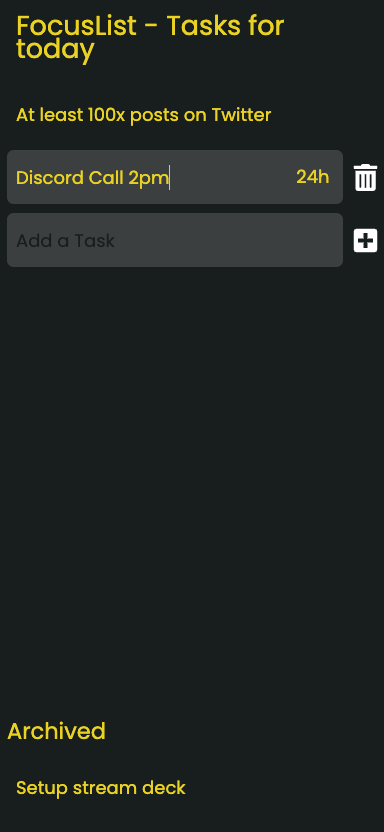

# FocusList

This app helps you focussing on your **daily** tasks.

No login needed: Tasks are only saved locally on your machine and not shared among other devices or databases.

You can create 5 tasks at most. After 24h all tasks that have not been completed will be moved to "Archived". All archived tasks will be deleted after another 24h.

You will notice that FocusList does not provide any "fancy" features - this is to prevent you from "playing" with the app as it is only intended for simple task creation.

Stay focussed. Stay motivated.

## Example

Currently I deployed my own FocusList to Netlify. You can do this as well and just fork this repo. It will look like this (mobile):

